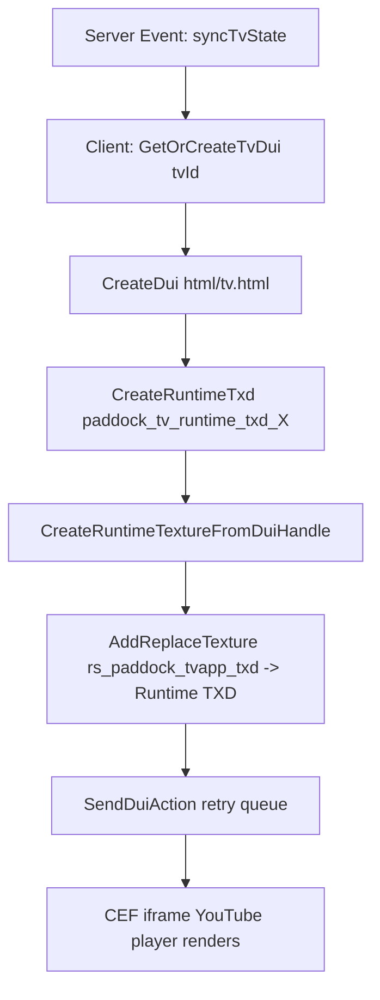

# 🛠️ rs_paddock_tv — Developer Architecture Guide (by bazq)

Technical reference documentation for developers extending, integrating, or auditing `rs_paddock_tv`.

---

## 🏗️ Technical Architecture

### 1. DUI & Dynamic Texture Replacement Workflow
The resource renders YouTube feeds onto 3D MLO screen props using FiveM's Direct User Interface (DUI) API and runtime texture replacement.



#### Key Natives Used
- `CreateDui(url, width, height)`: Spawns CEF browser instance running `html/tv.html`.
- `CreateRuntimeTxd(txdName)` & `CreateRuntimeTextureFromDuiHandle(txd, txnName, duiHandle)`: Wraps DUI render surface into a FiveM texture.
- `AddReplaceTexture(origTxd, origTxn, runtimeTxd, runtimeTxn)`: Overrides model texture in the engine.
- `RemoveReplaceTexture(origTxd, origTxn)` & `DestroyDui(duiObject)`: Restores original texture and cleans up memory on TV stop or resource stop.

---

### 2. Location-Isolated State Store
TV states are indexed by **Location Key** (`locKey`) and **TV ID** (`tvId`):

```lua
tvStates = {
    ["rs_paddock_def"] = {
        [1] = { url = "https://youtube.com/watch?v=...", playing = true, time = 45, volume = 30 },
        [2] = { url = "", playing = false, time = 0, volume = 30 },
        ...
        [7] = { ... }
    },
    ["rs_paddock_dock"] = { ... }
}
```

- Each Paddock location functions as an isolated broadcast zone.
- Server thread increments `state.time` every second for active streams per location.
- Late-joining players sync the current video timestamp (`time`) to resume video playback seamlessly.

---

### 3. Asynchronous DUI Message Retry Queue (`SendDuiAction`)
CEF browser initialization is asynchronous. Calling `SendDuiMessage` immediately after `CreateDui` can result in dropped messages. `SendDuiAction` resolves this using scheduled retry intervals:

```lua
local function SendDuiAction(tvId, actionData)
    local instance = GetOrCreateTvDui(tvId)
    if not instance or not instance.duiObject then return end

    local payload = json.encode(actionData)
    SendDuiMessage(instance.duiObject, payload)

    if instance.isNew then
        instance.isNew = false
        Citizen.SetTimeout(350, function()
            if duiInstances[tvId] and duiInstances[tvId].duiObject then
                SendDuiMessage(duiInstances[tvId].duiObject, payload)
            end
        end)
        Citizen.SetTimeout(700, function()
            if duiInstances[tvId] and duiInstances[tvId].duiObject then
                SendDuiMessage(duiInstances[tvId].duiObject, payload)
            end
        end)
    end
end
```

---

### 4. MLO EntitySet & Lighting Sync Flow
When a TV state changes, the client triggers `SyncTvEntitySets(locKey, closestLoc)`:

1. Resolves interior ID via `GetInteriorFromEntity(playerPed)` or `GetInteriorAtCoords(...)`.
2. Evaluates state for TV 1..7. If playing, calls `ActivateInteriorEntitySet(interiorId, entitySet)`.
3. If TV is stopped, calls `DeactivateInteriorEntitySet(interiorId, entitySet)`.
4. If changes occurred, calls `RefreshInterior(interiorId)` to instantly update MLO lighting and screen props.

---

### 5. Network Events Reference

#### Client Events
- `rs_paddock_tv:client:syncAllTvStates(states)`: Receives full location TV state tree from server upon connecting.
- `rs_paddock_tv:client:syncTvState(locKey, tvId, state)`: Receives real-time state update for a specific TV at a location.
- `rs_paddock_tv:client:showMenu(targetTvId, locKey, locTvStates)`: Opens the NUI control room panel with location data.

#### Server Events
- `rs_paddock_tv:server:requestSync`: Requests full TV state tree.
- `rs_paddock_tv:server:openMenu(targetTvId, reqLocKey)`: Validates distance and permissions before triggering menu.
- `rs_paddock_tv:server:updateState(data)`: Accepts `{ locationKey, targetScope, tvId, groupId, action, url, volume }` payload, updates server state store, and broadcasts sync events.

---

### 6. Modular Framework & Inventory Architecture
Framework abstractions reside in `client/framework.lua` and `server/framework.lua`.
Supported Core Frameworks: `qb-core`, `qbox`, `es_extended`, `ox_core`, `devix-core`.
Supported Inventories: `ox_inventory`, `qb-inventory`, `esx`, `devix-inventory`, `custom`.

---

### 7. Retro Store Radio (`rs_radio`) Integration
When `Config.UseRsRadio = true` and `rs_radio` is running, the server automatically registers persistent static audio emitters for all 5 Paddock locations via `exports.rs_radio:createStaticEmitter(spec)`. Listens for `onResourceStart` of `rs_radio` to re-initialize static emitters seamlessly on server restarts.

---

### 8. Retro Store Weather (`rs_weather`) Disaster Integration
When `Config.UseRsWeatherDisaster = true` and a natural disaster starts in `rs_weather` (`tsunami`, `tornado`):
- `rs-weather:disasterStarted` and `rs-weather:disasterPhaseChanged` events trigger `BroadcastDisasterEmergency(disasterState)`.
- Automatically overrides all 7 TVs across all locations with the Emergency Disaster Warning YouTube feed (`https://www.youtube.com/watch?v=xeXD7t16v8s`) at 100% volume (`Config.RsWeatherDisaster.Volume`).
- Activates MLO EntitySets (`rs_paddock_tv_app1..7`) to illuminate screens and lights during emergency.
- Saves pre-disaster video stream states and restores them when `rs-weather:disasterStopped` fires.
- Includes `/testdisaster [start / stop]` admin test command.

---

### 9. Shared DUI Pool & Runtime Texture Instancing
- When multiple TVs play the exact same video stream at the same synchronized timestamp (e.g., Disaster broadcasts, Group Sync, or Drag-and-Drop sharing), the client spawns **a single shared DUI browser instance** (`GetOrCreateSharedDui`).
- The runtime texture of the shared DUI instance is applied across all target TV screen models simultaneously using `AddReplaceTexture`.
- Results in 7x lower CPU/RAM footprint, 100% frame-perfect video synchronization, and zero network bandwidth spikes.
- If a TV plays the same video URL at a different timestamp, it automatically receives an independent DUI instance.

---

### 10. Drag & Drop Stream Sharing in NUI Control Room
- Drag any playing TV card in the Master Control Room UI and drop it onto any target TV card.
- Instantly copies the stream URL, timestamp, and playback state to the target TV.
- Automatically binds the target TV to the source TV's shared DUI texture instance for synchronized playback.

---

## 🛠️ Credits

- Codebase & Architecture by **bazq**.
- Special thanks & credit to **Cody Raves** for `rs_weather` & `rs_radio` ecosystem integrations, general development guidance, and the 3-layer FiveM DUI YouTube embed technique.
